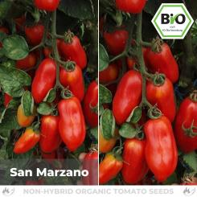
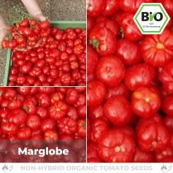
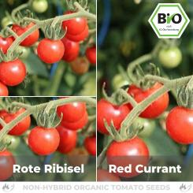
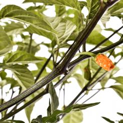
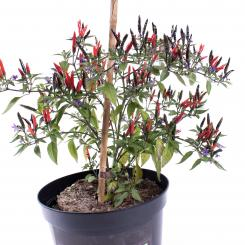
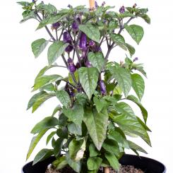
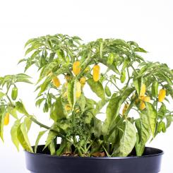

# 2023

## Tomaten

| Nr  | Tomate       | Bild                        | Link                                                                                                       |
| --- | ------------ | --------------------------- | ---------------------------------------------------------------------------------------------------------- |
| 1   | San Marzano  |    | <https://www.pepperworldhotshop.com/de/samen/tomaten-samen-bio/bio-san-marzano-tomatensamen-saucentomate/> |
| 2   | Marglobe     |      | <https://www.pepperworldhotshop.com/de/samen/tomaten-samen-bio/bio-marglobe-tomatensamen-salattomate/>     |
| 3   | Rote Ribisel |  | <https://www.pepperworldhotshop.com/de/samen/tomaten-samen-bio/bio-rote-ribisel-tomatensamen-wildtomate/>  |

## Chilis

| Nr  | Tomate                 | Bild                                  | Link                                                                                         |
| --- | ---------------------- | ------------------------------------- | -------------------------------------------------------------------------------------------- |
| 4   | Ayuyo Orange           |             | <https://www.pepperworldhotshop.com/de/samen/samen-highlights-2021/ayuyo-orange-chilisamen/> |
| 5   | Arlecchino             |              | <https://www.pepperworldhotshop.com/versand-samen/arlecchino-chilisamen/>                    |
| 6   | Trinidad Purple Coffee |  | <https://www.pepperworldhotshop.com/versand-samen/trinidad-purple-coffee-chilisamen/>        |
| 7   | Datil Super            |             | <https://www.pepperworldhotshop.com/de/produkte/datil-super-chilisamen/>                     |
