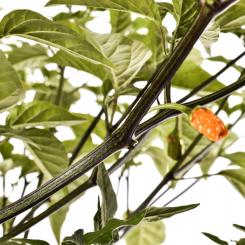

# 2024

| Nr  | Tomate            | Bild                                 | Link                                                                                          |
| --- | ----------------- | ------------------------------------ | --------------------------------------------------------------------------------------------- |
| 1   | Jamaican Bell     |      | <https://www.pepperworldhotshop.com/de/samen/chili-samen/jamaican-bell-chilisamen/>           |
| 2   | NuMex Pinata      |       | <https://www.pepperworldhotshop.com/de/sorten/jalapeno/numex-pinata-chilisamen/>              |
| 3   | Capela            |             | <https://www.pepperworldhotshop.com/de/samen/capsicum-frutescens/capela-chilisamen/>          |
| 4   | Birds Eye Baby    |     | <https://www.pepperworldhotshop.com/versand-samen/birds-eye-baby-chilisamen/>                 |
| 5   | Hot Paper Lantern |  | <https://www.pepperworldhotshop.com/de/samen/capsicum-chinense/hot-paper-lantern-chilisamen/> |
| 6   | Carolina Reaper   |    | <https://www.pepperworldhotshop.com/de/produkte/carolina-reaper-chilisamen/>                  |
