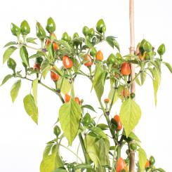

# 2024

Für Capsicum Annuum: min. 10 l
z.B.: Peperoni, Serrano, Jalapeño, Thai-Chili, Cayenne etc.

Für Capsicum Chinense: min. 12 - 15 l
z.B.: Habanero, Ghost Pepper, alle 7 Pots, Scorpions, Caroliner Reaper

Für Capsicum Baccatum: min. 30-40 l
z.B.: Bishops Crown, Aji Amarillo, Criolla Sella, Lemon Drop

Für Capsicum Pubescens: min. 30-40 l
z.B.: Roccoto in allen Varianten

| Nr  | Chili             | Schärfe | Capsicum   | Bild                                 | Link                                                                                                | Height      | Pot         | Current | Mini       |
| --- | ----------------- | ------- | ---------- | ------------------------------------ | --------------------------------------------------------------------------------------------------- | ----------- | ----------- | ------- | ---------- |
| 1   | Ayuyo Orange      | 5       | Baccatum   |       | [Link](https://www.pepperworldhotshop.com/de/samen/samen-highlights-2021/ayuyo-orange-chilisamen/)  | 50 - 80 cm  | 9L (30-40L) |         | 2x -> 9L   |
| 2   | Jamaican Bell     | 5       | Baccatum   |      | [Link](https://www.pepperworldhotshop.com/de/samen/chili-samen/jamaican-bell-chilisamen/)           | > 120 cm    | Beet        | 2x 9L;  | 2x -> 9L   |
| 3   | NuMex Pinata      | 6       | Annuum     |       | [Link](https://www.pepperworldhotshop.com/de/sorten/jalapeno/numex-pinata-chilisamen/)              | 50 - 80 cm  | 9L          | 2x 9L;  |            |
| 4   | Capela            | 7       | Frutescens |             | [Link](https://www.pepperworldhotshop.com/de/samen/capsicum-frutescens/capela-chilisamen/)          | 80 - 120 cm | 15L         | 4x 9L;  |            |
| 5   | Birds Eye Baby    | 8       | Annuum     |     | [Link](https://www.pepperworldhotshop.com/versand-samen/birds-eye-baby-chilisamen/)                 | < 50 cm     | 9L          |         | 1x -> Topf |
| 6   | Hot Paper Lantern | 9       | Chinense   |  | [Link](https://www.pepperworldhotshop.com/de/samen/capsicum-chinense/hot-paper-lantern-chilisamen/) | 80 - 120 cm | 15L         | 2x 9L;  | 2x -> 9L   |
| 7   | Carolina Reaper   | 10      | Chinense   |    | [Link](https://www.pepperworldhotshop.com/de/produkte/carolina-reaper-chilisamen/)                  | 80 - 120 cm | 15L         | 2x 9L;  | 1x         |
